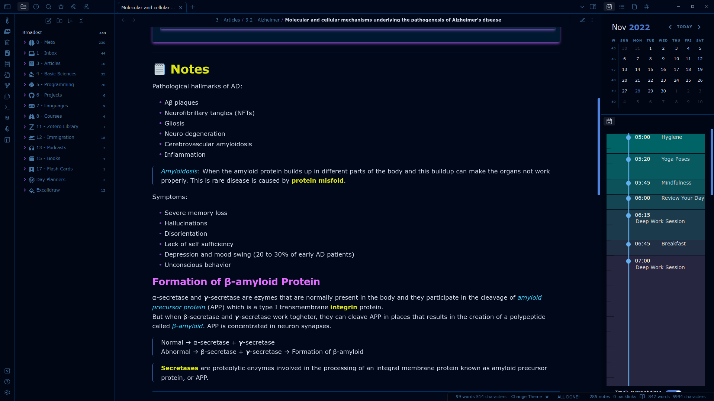
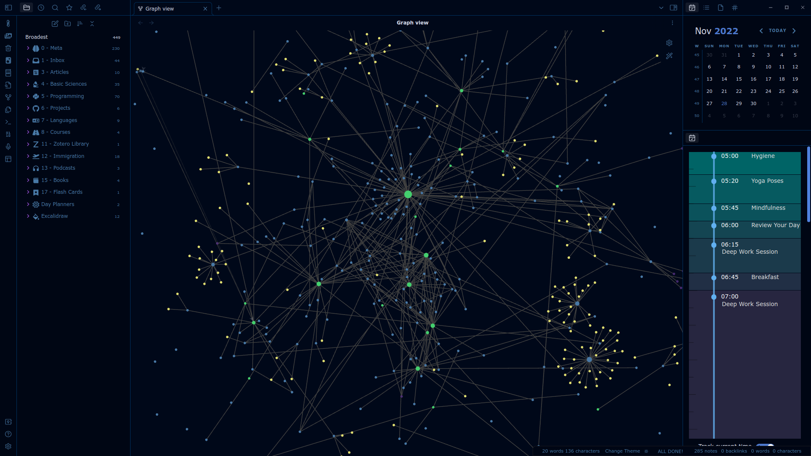
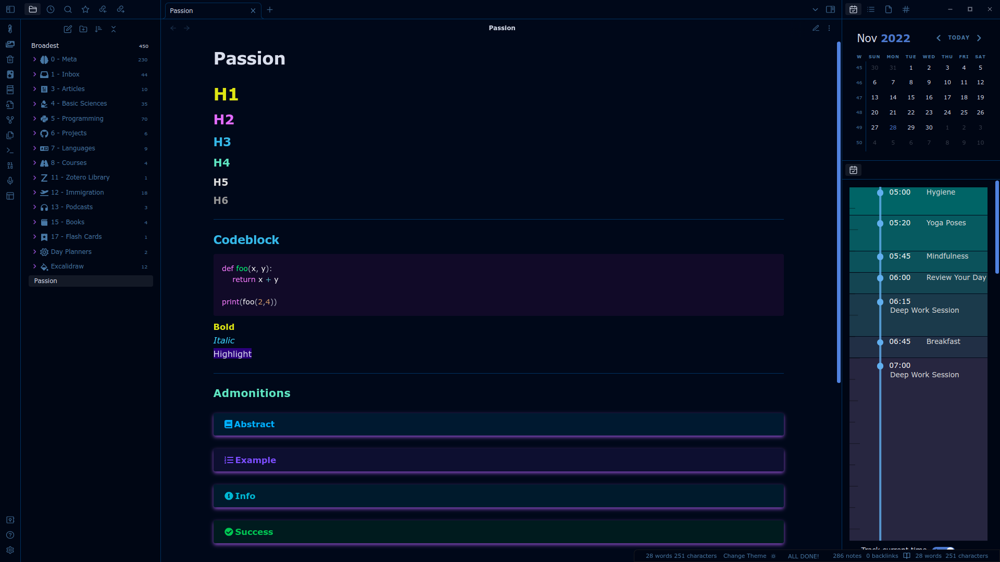
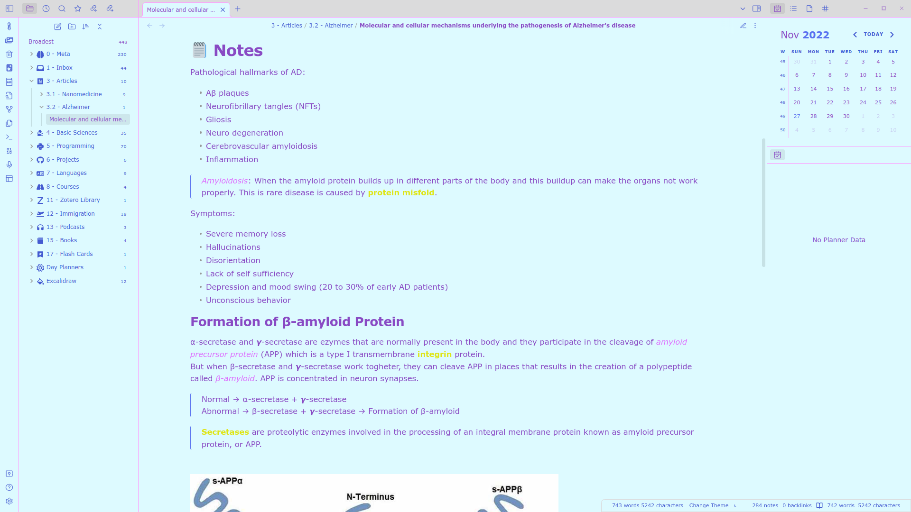
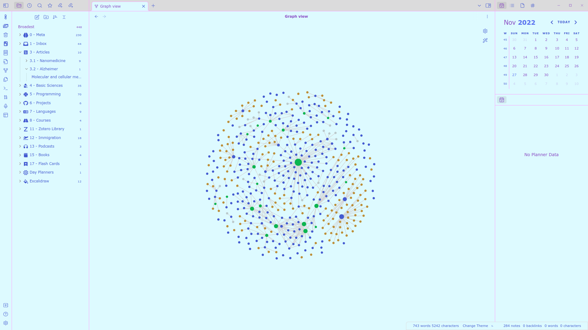

# Obsidian Passion Theme
Custom CSS theme for Obsidian:

- Dracula themed codeblocks
- Color coded headers
- Dark & light
- Colored bold, italic, highlight
- Compatible with most plugins
- Based on the Atom theme

## Dark Theme

## Light Theme

---
### ☕ Support
Give this repo a start and that's it thank you. :O
